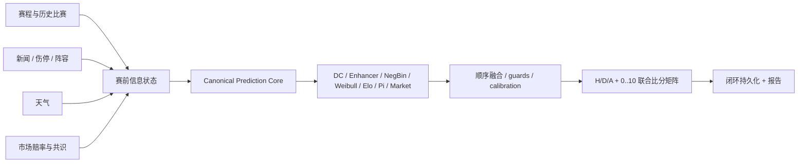
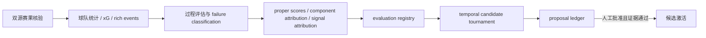

# WC26 Predict

> 可审计、可回放、严格隔离赛前与赛后信息的足球概率预测研究系统。


## 当前结论

V4.12 的重点是工程可信度，而不是宣称准确率已经提高：

- CLI、API、admin、worker 现在通过同一个 `canonical_prediction_core` 执行模型推理。
- 赛前预测必须闭环写入 `prediction_runs`、`pre_match_snapshots`、`prediction_snapshots`、`feature_snapshots`。
- 赛后复盘由 `run_postmatch_complete.py` 统一执行，学习只生成诊断和 proposal，不自动改权重或 artifact。
- DC、Enhancer、Elo、Pi、Weibull 从 active bundle 精确加载并校验 SHA-256；缺失或篡改会停止预测，不再现场重训。
- `active_bundle.json` 是唯一运行模型注册表；旧 `artifact_registry.py` / `model_registry.json` 已删除，训练只产出不可直接激活的 candidate bundle。
- 市场赔率/多公司共识是核心证据，继续参与模型；系统只禁止投注建议和保证性语言。
- 新闻、伤停、阵容、天气由 Information State Engine 变成带来源和时间戳的结构化 shadow 信号；LLM 不直接给最终概率。

**准确率尚未被 V4.12 证明。** 当前 registry 有 `93` 场独立比赛，其中 `35` strict、`47` diagnostic、`11` rejected。最近的 V4.11 同版本 strict 队列只有 `4` 场，V4.12 完赛队列为 `0`。任何上线结论都必须等待同版本 temporal walk-forward、proper scoring 和 paired CI 通过。

最新池化 shadow 锦标赛覆盖 9 个候选，全部被 gate 拒绝。Dynamic bivariate Poisson 的 H/D/A 点估计较好，但三项 paired CI 均跨 0，且配对 Score LogLoss 显著变差；它只能继续 shadow。池化历史指标也不能代表当前模型：其中 5 条旧校准输出含精确零概率，原始 LogLoss 为 `1.590134`，排除边界概率后的稳健切片为 `0.886515` (`n=30`)。

项目事实源：

- [当前项目状态](docs/CURRENT_PROJECT_STATE.md)
- [AI 交接协议](docs/AI_HANDOFF_PROTOCOL.md)
- `reports/audits/current_project_state.json`
- `backend/data/local_stage2.db`

刷新机器状态：

```powershell
backend/.venv/Scripts/python.exe backend/scripts/build_project_state_report.py --output reports/audits/current_project_state.json
```

## 第一性原理

系统预测的不是“命中一个比分”，而是条件概率分布：

```text
P(Home goals = i, Away goals = j | information available at as_of)
```

比分是高方差离散分布。正确目标是同时优化：

- H/D/A 的 LogLoss、Brier、RPS 和校准；
- 联合比分分布的 Score LogLoss；
- 总进球、净胜球、BTTS 等边际分布；
- Top-k 覆盖率和 posterior uncertainty；
- 90 分钟、加时、晋级概率的口径隔离。

精确比分命中率只能作为次级可读指标，不能作为模型选择目标。

## 预测链路



当前生产配置仍保留历史权重标签：小组赛 `WORLD_CUP_V4.7.0_ALPHA`，淘汰赛 `WORLD_CUP_KNOCKOUT_V4.8.1_ALPHA`。V4.12 没有修改数值权重。

比分矩阵由 DC、NegBin 和通过质量闸门的 Weibull source matrix 构成，最后会重新校准到最终 H/D/A 概率，避免“胜平负说一套、比分矩阵说另一套”。Weibull 矩阵过稀或单格异常集中时只进入 shadow。

## 复盘与自进化



赛后数据只用于复盘、学习日志和未来候选生成，不能回填同场赛前 strict snapshot。Match Data OS 可保存官方 raw payload、事件、射门、阵容分钟、球员统计、game-state segments 和 comeback profile；数据缺失时必须明确降级，不能补猜。

候选 promotion 至少要求：

- 同一 champion/model cohort；
- `n >= 30` 的工程下限，生产讨论仍以 `50+` strict 为目标；
- Brier、LogLoss、RPS 至少两个有 paired 改善；
- paired CI 不跨 0；
- 淘汰赛/小组赛等关键分组不显著退化；
- 人工批准。

## 唯一入口

在仓库根目录运行：

```powershell
# 人工赛前预测
backend/.venv/Scripts/python.exe backend/scripts/predict_match_full.py `
  --home "France" --away "Spain" `
  --competition "FIFA World Cup 2026" `
  --match-id 205

# 人工赛后复盘 + proposal-only 学习
backend/.venv/Scripts/python.exe backend/scripts/run_postmatch_complete.py `
  --match-id 205 --home-score 1 --away-score 0 `
  --verify-url "https://official-or-independent-source.example/match"

# API/admin/worker 临时 DB 闭环 smoke
backend/.venv/Scripts/python.exe backend/scripts/smoke_canonical_trigger.py
```

API、admin 和 worker 只能调用 `app.services.canonical_prediction_runner.run_canonical_prediction`。已删除的 orchestrator、wrapper 或双写入口不得恢复。

## Artifact 契约

`backend/artifacts/active_bundle.json` 保存当前运行模型的路径、SHA-256、文件大小和状态。

- `legacy_active_unvalidated`：可复现加载，但没有完整训练 provenance 或 promotion 证据。
- `candidate_unvalidated`：训练输出，只能 shadow，不能作为 active bundle 加载。
- `promoted`：必须附同版本 paired experiment 证据并人工激活。

pickle 仅用于已拟合模型图；运行时会读取同一份字节、校验大小与 SHA-256 后才反序列化。active manifest 必须由受信任部署身份只读管理。

运行模型文件是本地隔离资产，默认不提交 Git。部署或新机器接手必须安全配置这些文件，并运行：

```powershell
backend/.venv/Scripts/python.exe backend/scripts/verify_env.py
backend/.venv/Scripts/python.exe backend/scripts/smoke_canonical_trigger.py
```

## 安装

```powershell
python -m venv backend/.venv
backend/.venv/Scripts/python.exe -m pip install -r backend/requirements.txt
Copy-Item .env.example .env
```

从仓库根目录启动应用。当前 canonical API/worker prediction 要求 `POSTGRES_URL` 指向同一个 SQLite 文件；Postgres snapshot adapter 尚未实现，因此 Postgres 或路径不一致会 fail closed。

必须配置：

| 变量 | 用途 |
|:---|:---|
| `ADMIN_TOKEN` | 至少 32 字符的随机 bearer token |
| `ODDS_API_KEY` / `API_FOOTBALL_KEY` / `APIFOOTBALL_COM_KEY` | 市场赔率来源，可按可用 provider 配置 |
| `FOOTBALL_DATA_API_KEY` | 赛程/结果来源 |
| `LLM_API_KEY` | 可选，结构化情报和解释生成 |

不得提交 `.env*`、数据库备份或本地 runtime artifacts。

## 验证

```powershell
backend/.venv/Scripts/python.exe -m pytest backend/tests -q
backend/.venv/Scripts/python.exe -m ruff check backend/app backend/scripts backend/tests
backend/.venv/Scripts/python.exe -m compileall -q backend/app backend/scripts
backend/.venv/Scripts/python.exe backend/scripts/audit_db_integrity.py
backend/.venv/Scripts/python.exe backend/scripts/audit_report_paths.py --json
backend/.venv/Scripts/python.exe backend/scripts/audit_entrypoints.py --json
backend/.venv/Scripts/python.exe backend/scripts/audit_public_outputs.py
backend/.venv/Scripts/python.exe backend/scripts/preflight_accuracy_experiments.py
backend/.venv/Scripts/python.exe -m bandit -r backend/app backend/scripts
$env:PYTHONUTF8='1'; backend/.venv/Scripts/python.exe -m pip_audit -r backend/requirements.txt
git diff --check
```

## 目录

```text
backend/app/services/canonical_prediction_core.py   唯一模型推理适配器
backend/app/services/prediction_pipeline.py         当前生产模型链
backend/app/services/information_state_engine.py    赛前证据和结构化信号
backend/app/services/match_data/                    官方赛后数据与 game state
backend/app/services/evaluation_registry.py         strict/diagnostic/rejected 事实口径
backend/app/services/candidate_experiments.py       temporal shadow 实验
backend/scripts/predict_match_full.py               唯一人工赛前入口
backend/scripts/run_postmatch_complete.py           唯一人工赛后入口
reports/                                            当前报告和审计结果
memory/                                             逐场可追溯记忆
```

## English Summary

WC26 Predict is an auditable football probability research system. V4.12 unifies every prediction surface behind one inference core, enforces closed-loop persistence, verifies exact model artifacts, keeps market odds as a core signal, and limits post-match learning to diagnostics and proposals.

Predictive improvement is **not yet proven**. The local registry contains 93 independent matches but only 35 strict samples across many historical model cohorts; the latest predecessor cohort has only four completed strict samples, and V4.12 has none. Model selection must use same-cohort temporal walk-forward evaluation, proper scoring rules, paired confidence intervals, and manual promotion.

The score forecast is a joint probability distribution, not a single deterministic score. Optimize Score LogLoss, marginal calibration, Top-k coverage, and uncertainty; treat exact-score hit rate as a secondary descriptive metric.
