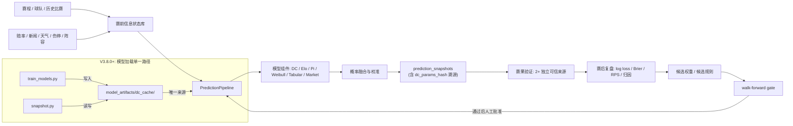
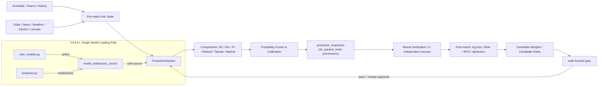

# WC26 Predict / WC26 预测系统

> 2026 FIFA World Cup prediction research system. One goal: make predictions more accurate under auditable, reproducible, data-leak-free conditions.
>
> 2026 世界杯概率预测研究系统。目标只有一个：在可审计、可复现、无数据泄漏的前提下，把预测做得更准。

<p align="center">
  
  
  
  
  
  
</p>

---

## 中文版

### 当前结论

WC26 Predict 现在处在 **V4.11 Match Data OS + Game-State Engine** 阶段：在 V4.10 赛前信息状态引擎之上，把 FIFA 官方赛后数据、事件时间线、阵容分钟、球员统计和比赛状态分段纳入可追溯的赛后复盘与自进化学习资产。

**AI 接手前必须先读：**

- 当前项目事实源：[docs/CURRENT_PROJECT_STATE.md](docs/CURRENT_PROJECT_STATE.md)
- AI 交接协议：[docs/AI_HANDOFF_PROTOCOL.md](docs/AI_HANDOFF_PROTOCOL.md)
- 机器可读状态报告：`reports/audits/current_project_state.json`

刷新状态报告：

```powershell
backend/.venv/Scripts/python.exe backend/scripts/build_project_state_report.py --output reports/audits/current_project_state.json
```

**V4.11.0-alpha（2026-07-08）当前状态：**

- **测试状态**：`569 passed, 4 skipped`（最近一次本地后端全量测试；V4.11 Match Data OS 与 Project State OS 已纳入全量验证）。
- **代码版本**：`4.11.0-alpha`；当前代码中的 WC 权重标签仍为 group `WORLD_CUP_V4.7.0_ALPHA`、knockout `WORLD_CUP_KNOCKOUT_V4.8.1_ALPHA`；V4.11 不改生产权重。
- **本地样本口径**：evaluation registry 显示 `91` 个 canonical result 样本，其中 `36` 个 strict eligible backtest 样本、`47` 个 diagnostic 样本、`8` 个 rejected 样本，`source_result_conflicts=0`；任何准确率结论必须先说明采用哪个口径。
- **预测流水线**：DC → Enhancer → NegBin(5%) → Weibull → Elo → Pi → Market（7 级顺序融合）+ 战意因子 + 平局下限 12% + 分歧自适应 + 动态市场提升 + DC半衰期学习(180d最优) + A3 Stacking元学习器(21维特征) + B1加权共形预测(α=0.1)
- **复盘数据完整性**：当前 DB `postmatch_process_eval` 为 `24` 条、`match_team_statistics` 为 `42` 条；strict 回测不能直接把所有已完赛 schedule 样本混入。
- **数据库完整性**：SQLite `PRAGMA integrity_check=ok`，`PRAGMA foreign_key_check=0`；历史孤儿行保留在 `data_integrity_quarantine` 供审计。
- **新功能**：V4.11 Match Data OS：`match_data_raw` 官方赛后 raw ledger、`match_events` 事件时间线、`shot_events` 射门事件、`match_lineups` / `player_match_minutes` 阵容分钟、`match_player_statistics` 球员统计、`match_game_state_segments` 比赛状态分段；赛后报告会在有 rich data 时输出 goal timeline、game-state segments 和 comeback profile。Project State OS 已新增机器可读状态报告和 AI 交接协议。
- **已知风险**：strict 样本仍只有 `36` 场，距离 `50+` 目标仍差 `14` 场；任何候选模型都不能据此上线，只能进入 shadow/proposal 流程。

### 系统目标

本项目不是赛事商业导流产品，也不提供赛事情境决策建议。它是一个面向足球预测研究、赛前信息状态管理、模型回测和赛后复盘的工程系统。

核心问题只有四个：

1. 赛前某个时间点，系统真实知道什么？
2. 在只使用当时已知信息的前提下，模型给出了什么概率？
3. 赛后结果出来后，预测错在哪里？
4. 候选改进能否在 walk-forward 回测中稳定降低 log loss / Brier / RPS？

### 架构概览



### 代码结构

```text
backend/app/                 FastAPI 后端与核心服务
backend/app/core/engine.py   纯融合引擎 (NegBin, DC-Enhancer, DrawFloor) — 零 IO
backend/app/services/        预测、快照、学习、验证、评估服务 (40+ 文件)
backend/app/services/match_data/        V4.11 官方赛后数据、事件标准化、比赛状态引擎
backend/app/models/          SQLAlchemy ORM 模型 (22+ 表)
backend/app/routers/         FastAPI 路由 (9个)
backend/app/services/weights.py          权重配置 (WORLD_CUP_V4.7.0_ALPHA)
backend/artifacts/           模型工件 (calibrator, ratings)
backend/model_artifacts/dc_cache/        模型磁盘缓存 (DC + Enhancer)
backend/scripts/             CLI 脚本 (预测、复盘、模拟、训练)
backend/tests/               测试 (561 passed, 4 skipped)
backend/dashboard/           Streamlit 本地研究工作台 (9 页面)
backend/data/                SQLite 数据库 + 数据文件
reports/                     当前预测报告
reports/postmatch/           当前赛后复盘报告
docs/                        架构、合规文档
```

### 快速开始

> V3.5 清理后不提交本地依赖目录。首次运行请重新安装依赖。

```bash
# 克隆仓库
git clone https://github.com/AndyDu0921/wc26-predict.git
cd wc26-predict

# 后端
cd backend
python -m venv .venv

# Windows
.\.venv\Scripts\Activate.ps1
# macOS / Linux
source .venv/bin/activate

pip install -r requirements.txt
```

**环境变量：**

```bash
# 从模板创建 .env
cp .env.example .env
# 编辑 .env，填入你的 API Key
```

必需的环境变量：

| 变量 | 说明 |
|:---|:---|
| `ADMIN_TOKEN` | 管理 API 令牌（**不能使用默认值 change-me**） |
| `APIFOOTBALL_COM_KEY` | apifootball.com API Key（市场赔率） |
| `ODDS_API_KEY` | The Odds API Key（市场赔率） |
| `LLM_API_KEY` | DeepSeek API Key（可选，LLM 内容生成） |

重要安全要求：

- `ADMIN_TOKEN` 不能使用默认值 `change-me`。
- `.env`、`.env.local`、`backend/.env` 不应提交到 Git。
- API key 泄露后应立即轮换。

**数据库初始化：**

```bash
cd backend
# SQLite 默认自动创建，无需额外配置
# 如有 schema 变更，运行迁移：
alembic upgrade head
```

**验证安装：**

```bash
cd backend

# 1. 运行测试
python -m pytest tests/ -q --tb=short
# 预期: 561 passed, 4 skipped

# 2. 检查 API 健康状态
python -c "from app.main import app; print('FastAPI app loaded OK')"

# 3. 环境验证
python scripts/verify_env.py
```

**生产追溯审计：**

```bash
cd backend
python scripts/audit_entrypoints.py
python scripts/audit_report_paths.py
python scripts/audit_db_integrity.py
python scripts/preflight_accuracy_experiments.py
python scripts/audit_public_outputs.py
python scripts/audit_match_information_state.py --match-id 199 --home "Portugal" --away "Spain"
python scripts/audit_rich_postmatch_data.py --match-id 194 --json
python scripts/audit_rich_postmatch_data.py --match-id 194 --json
```

### 常用命令

**预测与复盘：**

```bash
cd backend

# 生成单场完整预测分析报告
python scripts/predict_match_full.py --home "Brazil" --away "Germany" \
  --competition "FIFA World Cup 2026" --stage "Group A - Matchday 1"

# 单场运行赛后复盘 + 自进化
python scripts/run_postmatch_complete.py

# 每日自动复盘
python scripts/auto_postmatch.py

# 单场复盘审查
python scripts/postmatch_review.py
```

**V4.11 官方赛后数据 / Match Data OS：**

```bash
cd backend

# 1. 采集 FIFA 官方 Match Centre / report 原始证据
python scripts/collect_official_match_data.py \
  --match-id 194 \
  --source-url "https://www.fifa.com/en/match-centre/match/17/285023/289288/400021528"

# 2. 标准化事件、射门、阵容、球员统计
python scripts/normalize_match_events.py \
  --match-id 194 --home-team "Argentina" --away-team "Egypt"

# 3. 生成比赛状态分段与 comeback profile
python scripts/build_game_state_segments.py \
  --match-id 194 --home-score 3 --away-score 2

# 4. 审计 rich postmatch 数据完整性
python scripts/audit_rich_postmatch_data.py --match-id 194 --json
```

这些数据只属于赛后复盘和 proposal-only 自进化，不进入同场赛前 strict feature snapshot。

**当前入口白名单：**

- 赛前预测：`backend/scripts/predict_match_full.py`
- 赛后复盘：`backend/scripts/run_postmatch_complete.py`
- 准确率实验：`backend/scripts/run_accuracy_experiments.py`
- 实验预检：`backend/scripts/preflight_accuracy_experiments.py`
- DB 审计：`backend/scripts/audit_db_integrity.py`
- 公开输出审计：`backend/scripts/audit_public_outputs.py`
- 信息证据采集：`backend/scripts/collect_match_evidence.py`
- 信息信号抽取：`backend/scripts/extract_information_signals.py`
- 信息信号评分：`backend/scripts/score_information_signals.py`
- 信息状态审计：`backend/scripts/audit_match_information_state.py`
- 官方赛后数据采集：`backend/scripts/collect_official_match_data.py`
- 事件/阵容标准化：`backend/scripts/normalize_match_events.py`
- 比赛状态分段：`backend/scripts/build_game_state_segments.py`
- rich postmatch 审计：`backend/scripts/audit_rich_postmatch_data.py`

**WC26 赛程与模拟：**

```bash
cd backend

# 种子数据
python scripts/seed_wc26_schedule.py

# 锦标赛蒙特卡洛模拟
python scripts/simulate_wc26.py

# 模型训练
python scripts/train_models.py
```

**本地 Dashboard：**

```bash
cd backend
streamlit run dashboard/app.py
# 或: powershell -File scripts/start_dashboard.ps1
```

**API 服务：**

```bash
cd backend
uvicorn app.main:app --reload --port 8000
# API 文档: http://localhost:8000/docs
# OpenAPI Schema: http://localhost:8000/openapi.json
```

### 当前评估标准

V3.5 之后，任何"更准"的结论必须满足这些门槛：

- 使用 walk-forward，而不是随机切分。
- 按真实时间模拟 `T-24h`、`T-6h`、`T-90m`。
- 主指标固定为 log loss、Brier、RPS。accuracy 只作为辅助指标。
- 每个版本保留输入 hash、数据时间戳、模型版本、权重版本、校准版本。
- 新模型至少在两个 proper scoring 指标上超过 champion，并且关键分组不明显退化。
- 配对比较必须优先于非配对 leaderboard。

### 数据优先级

下一阶段优先补齐的是数据链，而不是新模型数量。

高优先级数据：

- 真实 xG、射门、射正、红黄牌、定位球。
- 首发阵容、出场分钟、伤停、停赛、球员可用性。
- 休息天数、旅行距离、场地、天气、海拔、时区。
- FIFA ranking、Elo、赛事重要性、杯赛/友谊赛/淘汰赛标签。
- 市场赔率快照与多博彩商共识，这是核心高价值赛前信号；必须带时间戳并通过泄漏保护。

所有数据必须带 `source`、`source_time`、`available_at`、`match_id`、team id 映射。

### 迭代路线

**Phase 0B：数据链路修复** — 回填历史 snapshot/match_id、稳健的 match resolver、统一数据绑定。

**Phase 1：walk-forward 回测门** — 模型分开评估、按 horizon/比赛类型分组、paired gate。

**Phase 1C：统一评估样本输出** — 收敛 CLI/API/脚本分叉到 `PredictionPipeline`。

**Phase 2：高价值赛前数据** — 真实 xG、阵容、伤停、赔率、天气、休息与旅途。

**Phase 3：模型升级** — time-decay DC、动态 bivariate Poisson、Bayesian hierarchical 国家队模型。

**Phase 4：可控自进化** — 每场赛后自动误差归因、候选权重需通过回测 + 人工批准。

### 合规声明

- 本项目用于研究、教育和内容分析。
- 不提供赛事情境决策建议。
- 不承诺预测准确率。
- 不展示诱导性商业导流结论。
- 公开输出应优先解释不确定性、数据来源和模型局限。

详见 [`docs/COMPLIANCE_AND_OUTPUT_POLICY.md`](docs/COMPLIANCE_AND_OUTPUT_POLICY.md)。

### 版本历史

当前主版本：**V4.11.0-alpha**

| 版本 | 日期 | 关键变更 |
|------|------|---------|
| **V4.11.0-alpha** | 2026-07-08 | Match Data OS: FIFA 官方赛后 raw ledger + 事件/射门/阵容/球员统计标准化 + game-state segments + comeback profile + rich postmatch 审计 |
| **V4.10.0-alpha** | 2026-07-07 | Real-time information state engine: evidence ledger + structured signal scoring + signal attribution + information-state preflight |
| **V4.9.0-alpha** | 2026-07-05 | Accuracy Data OS: repair report v2 + accuracy todo backlog + experiment preflight + structured pre-match signals + FeatureSnapshot v2 + proposal-only self-evolution |
| **V4.8.0-alpha** | 2026-07-04 | Accuracy Engine: registry v2 + PredictionKernel + shadow candidate experiments + generic proposal ledger |
| **V4.7.0-alpha** | 2026-07-03 | 三源比分矩阵融合 + 学习引擎比分归因 + BacktestGate proposal-only 权重候选 + snapshot 可回放元数据 + stacking 安全门 |
| **V4.5.0-beta** | 2026-07-01 | A3 Stacking元学习器(7组件×3结果=21维LR) + B1加权共形预测(α=0.1 halflife=30d) + DC半衰期学习(180d最优) + 全文档化魔数注册表 |
| **V4.4.2-beta** | 2026-06-30 | 全流水线回测验证 + 有效权重报告 + P1-2参数验证 |
| **V4.4.1-beta** | 2026-06-29 | 结构自洽修复: Score Matrix Calibrator + KO Draw Guard + λ公式审计 + Gates全路径接入 |
| **V4.3.11-beta** | 2026-06-29 | B2 MC λ公式升级 + B3 去水分域驱动修正 |
| **V4.3.0-beta** | 2026-06-26 | NegBin 5%融合 + 积分榜填表 + 校准器重建(69样本) + core/engine.py 纯融合引擎 |
| **V4.2.2-beta** | 2026-06-25 | 自进化 Pi 0.12→0.14 + 6场 June25 赛后复盘 |
| **V4.2.1-beta** | 2026-06-25 | 8项修复: pipeline 同步/战意/平局下限/分歧悖论 |
| **V4.2.0-beta** | 2026-06-24 | 战意因子 + 平局下限 + 分歧悖论修复 |
| **V4.1.6-beta** | 2026-06-24 | 全局版本同步 + 代码库清理 |
| V4.0.5 | 2026-06-20 | 动态 Market Boost + 自适应 DC 权重 |
| V3.8.0 | 2026-06-15 | 模型加载链修复 + 权重门控 + 参数溯源 |

### 贡献

欢迎关注这些方向：

- 无泄漏历史数据集构建
- 国家队球员层数据与阵容强度建模
- walk-forward benchmark 与校准评估
- 赛后误差归因与自动学习报告
- 公开输出合规策略

详见 [`CONTRIBUTING.md`](CONTRIBUTING.md)。

---

## English Version

### Current Status

WC26 Predict is in the **V4.11 Match Data OS + Game-State Engine** phase: on top of V4.10 pre-match information state, official FIFA post-match data, event timelines, lineup minutes, player stats, and game-state segments are now traceable post-match learning assets.

**V4.11.0-alpha (2026-07-08) State:**

- **Tests**: `561 passed, 4 skipped` on the latest full local suite; V4.11 Match Data OS tests are included in full validation.
- **Code version**: `4.11.0-alpha`; current WC weight labels remain group `WORLD_CUP_V4.7.0_ALPHA` and knockout `WORLD_CUP_KNOCKOUT_V4.8.1_ALPHA`; V4.11 does not auto-apply production weights.
- **Local sample registry**: `91` canonical result samples, `36` strict eligible backtest samples, `47` diagnostic samples, `8` rejected samples, and `source_result_conflicts=0`. Accuracy claims must state the sample definition.
- **Fusion chain**: DC → Enhancer → NegBin(5%) → Weibull → Elo → Pi → Market (7-stage sequential fusion) + motivation factor + 12% draw floor + adaptive divergence guard + dynamic market boost + DC half-life learning (180d optimal) + A3 Stacking meta-learner (21-dim features) + B1 Weighted Conformal Prediction (α=0.1)
- **Post-match data completeness**: local DB has `20` `postmatch_process_eval` rows and `34` `match_team_statistics` rows. Strict backtests must not mix all schedule-finished rows without registry filtering.
- **DB integrity**: SQLite `PRAGMA integrity_check=ok` and `PRAGMA foreign_key_check=0`; historical orphan rows are preserved in `data_integrity_quarantine` for auditability.
- **New**: V4.11 Match Data OS: official post-match raw ledger, event timeline, shot events, lineups/player minutes, player statistics, game-state segments, goal timeline, and comeback profile for rich post-match reviews.
- **Known risk**: strict evidence is still limited to `36` samples, `14` below the `50+` target; dynamic candidates remain shadow-only until paired proper-scoring gates pass.
- **Self-evolution**: proposal-only. The system can write `model_change_proposals`, but no proposal is auto-applied to production weights, calibrators, or artifacts.
- **Known issues**: diagnostic/rejected samples are mostly missing pre-match snapshots, timestamp evidence, or current probabilities; data repair has higher priority than adding more production models.

### Project Goals

This is not a commercial tipping product. It is an engineering system for football prediction research, pre-match information state management, model backtesting, and post-match review.

Four core questions:

1. What did the system actually know at a given pre-match point in time?
2. Given only that information, what probabilities did the model output?
3. After the result is known, where was the prediction wrong?
4. Can candidate improvements stably reduce log loss / Brier / RPS in walk-forward backtesting?

### Architecture



### Code Structure

```text
backend/app/                 FastAPI backend & core services
backend/app/core/engine.py   Pure fusion engine (NegBin, DC-Enhancer, DrawFloor) — zero IO
backend/app/services/        Prediction, snapshot, learning, verification, evaluation (40+ files)
backend/app/services/match_data/        V4.11 official post-match data, event normalization, game-state engine
backend/app/models/          SQLAlchemy ORM models (22+ tables)
backend/app/routers/         FastAPI routes (9 endpoints)
backend/app/services/weights.py          Weight config (WORLD_CUP_V4.7.0_ALPHA)
backend/artifacts/           Model artifacts (calibrator, ratings)
backend/model_artifacts/dc_cache/        Disk-cached models (DC + Enhancer)
backend/scripts/             CLI scripts (predict, review, simulate, train)
backend/tests/               Tests (561 passed, 4 skipped)
backend/dashboard/           Streamlit research dashboard (9 pages)
backend/data/                SQLite database + data files
reports/                     Current prediction reports
reports/postmatch/           Current post-match review reports
docs/                        Architecture & compliance docs
```

### Quick Start

> Local dependency directories are not committed. Reinstall on first run.

```bash
# Clone
git clone https://github.com/AndyDu0921/wc26-predict.git
cd wc26-predict

# Backend
cd backend
python -m venv .venv

# Windows
.\.venv\Scripts\Activate.ps1
# macOS / Linux
source .venv/bin/activate

pip install -r requirements.txt
```

**Environment variables:**

```bash
# Create .env from template
cp .env.example .env
# Edit .env with your API keys
```

Required environment variables:

| Variable | Description |
|:---|:---|
| `ADMIN_TOKEN` | Admin API token (**must not use default `change-me`**) |
| `APIFOOTBALL_COM_KEY` | apifootball.com API key (market odds) |
| `ODDS_API_KEY` | The Odds API key (market odds) |
| `LLM_API_KEY` | DeepSeek API key (optional, for LLM content generation) |

Security:

- `ADMIN_TOKEN` must not use the default value `change-me`.
- `.env`, `.env.local`, `backend/.env` must not be committed.
- Rotate API keys immediately upon exposure.

**Database setup:**

```bash
cd backend
# SQLite auto-creates on first use — no extra config needed
# If schema has changed, run migrations:
alembic upgrade head
```

**Verify installation:**

```bash
cd backend

# 1. Run tests
python -m pytest tests/ -q --tb=short
# Expected: 561 passed, 4 skipped

# 2. Check API health
python -c "from app.main import app; print('FastAPI app loaded OK')"

# 3. Environment check
python scripts/verify_env.py
```

**Production traceability audit:**

```bash
cd backend
python scripts/audit_entrypoints.py
python scripts/audit_report_paths.py
python scripts/audit_db_integrity.py
python scripts/preflight_accuracy_experiments.py
python scripts/audit_public_outputs.py
python scripts/audit_match_information_state.py --match-id 199 --home "Portugal" --away "Spain"
```

### Common Commands

**Prediction & Post-match:**

```bash
cd backend

# Full prediction + analysis report
python scripts/predict_match_full.py --home "Brazil" --away "Germany" \
  --competition "FIFA World Cup 2026" --stage "Group A - Matchday 1"

# Single-match post-match review + self-evolution
python scripts/run_postmatch_complete.py

# Daily automated review
python scripts/auto_postmatch.py

# Single match review
python scripts/postmatch_review.py
```

**V4.11 Official Post-match Data / Match Data OS:**

```bash
cd backend

# 1. Capture FIFA official Match Centre / report raw evidence
python scripts/collect_official_match_data.py \
  --match-id 194 \
  --source-url "https://www.fifa.com/en/match-centre/match/17/285023/289288/400021528"

# 2. Normalize events, shots, lineups, and player stats
python scripts/normalize_match_events.py \
  --match-id 194 --home-team "Argentina" --away-team "Egypt"

# 3. Build game-state segments and comeback profile
python scripts/build_game_state_segments.py \
  --match-id 194 --home-score 3 --away-score 2

# 4. Audit rich post-match completeness
python scripts/audit_rich_postmatch_data.py --match-id 194 --json
```

These records are post-match-only learning evidence and must not be joined into the same-match pre-match strict feature snapshot.

**Current entrypoint allowlist:**

- Pre-match prediction: `backend/scripts/predict_match_full.py`
- Post-match review: `backend/scripts/run_postmatch_complete.py`
- Accuracy experiments: `backend/scripts/run_accuracy_experiments.py`
- Experiment preflight: `backend/scripts/preflight_accuracy_experiments.py`
- DB audit: `backend/scripts/audit_db_integrity.py`
- Public output audit: `backend/scripts/audit_public_outputs.py`
- Evidence collection: `backend/scripts/collect_match_evidence.py`
- Signal extraction: `backend/scripts/extract_information_signals.py`
- Signal scoring: `backend/scripts/score_information_signals.py`
- Information-state audit: `backend/scripts/audit_match_information_state.py`
- Official post-match collection: `backend/scripts/collect_official_match_data.py`
- Event/lineup normalization: `backend/scripts/normalize_match_events.py`
- Game-state segments: `backend/scripts/build_game_state_segments.py`
- Rich post-match audit: `backend/scripts/audit_rich_postmatch_data.py`

**WC26 Schedule & Simulation:**

```bash
cd backend

# Seed schedule data
python scripts/seed_wc26_schedule.py

# Monte Carlo tournament simulation
python scripts/simulate_wc26.py

# Model training
python scripts/train_models.py
```

**Dashboard:**

```bash
cd backend
streamlit run dashboard/app.py
```

**API Server:**

```bash
cd backend
uvicorn app.main:app --reload --port 8000
# API docs: http://localhost:8000/docs
# OpenAPI schema: http://localhost:8000/openapi.json
```

### Evaluation Standards

Post-V3.5, any "better" claim must meet these thresholds:

- Walk-forward splits only, never random.
- Simulate real-time horizons: `T-24h`, `T-6h`, `T-90m`.
- Primary metrics: log loss, Brier, RPS. Accuracy is secondary only.
- Every version records input hash, data timestamp, model version, weight version, calibration version.
- New model must beat champion on at least two proper scoring metrics with no significant subgroup degradation.
- Paired comparison is mandatory; never compare across different evaluation samples.

### Data Priorities

High-priority data for the next phase:

- Real xG, shots, shots on target, cards, set pieces.
- Starting lineups, minutes played, injuries, suspensions, player availability.
- Rest days, travel distance, venue, weather, altitude, timezone.
- FIFA ranking, Elo, competition importance, cup/friendly/knockout tags.
- Market odds snapshots and multi-bookmaker consensus — high-value pre-match signals that must carry timestamps and leakage protection.

All data must carry: `source`, `source_time`, `available_at`, `match_id`, team id mapping.

### Roadmap

**Phase 0B: Data Link Repair** — Backfill historical snapshots, robust match resolver, unified data binding.

**Phase 1: Walk-Forward Backtest Gate** — Per-component evaluation, horizon/type grouping, paired gate.

**Phase 1C: Unified Evaluation Sample Output** — Converge CLI/API/script forks into `PredictionPipeline`.

**Phase 2: High-Value Pre-Match Data** — Real xG, lineups, injuries, odds, weather, rest & travel.

**Phase 3: Model Upgrades** — Time-decay DC, dynamic bivariate Poisson, Bayesian hierarchical national-team model.

**Phase 4: Controlled Self-Evolution** — Auto error attribution per match, candidate weights require backtest + human approval.

### Compliance Statement

- This project is for research, education, and content analysis.
- It does not provide match outcome decision advice.
- It does not promise prediction accuracy.
- It does not display inducements for commercial tipping.
- Public outputs should prioritize explaining uncertainty, data sources, and model limitations.

See [`docs/COMPLIANCE_AND_OUTPUT_POLICY.md`](docs/COMPLIANCE_AND_OUTPUT_POLICY.md) for the full policy.

### Version History

Current version: **V4.10.0-alpha**

| Version | Date | Key Changes |
|------|------|---------|
| **V4.10.0-alpha** | 2026-07-07 | Real-time information state engine: evidence ledger + structured signal scoring + signal attribution + information-state preflight |
| **V4.9.0-alpha** | 2026-07-05 | Accuracy Data OS: repair report v2 + accuracy todo backlog + experiment preflight + structured pre-match signals + FeatureSnapshot v2 + proposal-only self-evolution |
| **V4.8.0-alpha** | 2026-07-04 | Accuracy Engine: registry v2 + PredictionKernel + shadow candidate experiments + generic proposal ledger |
| **V4.7.0-alpha** | 2026-07-03 | Score-matrix fusion + score-level learning attribution + BacktestGate proposal-only weight candidates + replayable snapshot metadata + stacking safety gates |
| **V4.5.0-beta** | 2026-07-01 | A3 Stacking meta-learner (7 components × 3 outcomes = 21-dim LR) + B1 Weighted Conformal Prediction (α=0.1 halflife=30d) + DC half-life learning (180d optimal) + complete magic number registry |
| **V4.4.2-beta** | 2026-06-30 | Full-pipeline backtest verification + effective weights report + P1-2 parameter validation |
| **V4.4.1-beta** | 2026-06-29 | Structural consistency: Score Matrix Calibrator + KO Draw Guard + λ audit + Gates in pipeline |
| **V4.3.11-beta** | 2026-06-29 | B2 MC λ formula upgrade + B3 domain-driven de-vig |
| **V4.3.0-beta** | 2026-06-26 | NegBin 5% fusion + group standings + calibrator rebuild (69 samples) + core/engine.py |
| **V4.2.2-beta** | 2026-06-25 | Self-evolution Pi 0.12→0.14 + 6-match June25 post-match |
| **V4.2.1-beta** | 2026-06-25 | 8 fixes: pipeline sync, motivation, draw floor, divergence paradox |
| **V4.2.0-beta** | 2026-06-24 | Motivation factor + draw floor + divergence paradox fix |
| **V4.1.6-beta** | 2026-06-24 | Global version sync + codebase cleanup |
| V4.0.5 | 2026-06-20 | Dynamic Market Boost + adaptive DC weight |
| V3.8.0 | 2026-06-15 | Model loading chain fix + weight gating + parameter provenance |

### Contributing

Contributions are welcome in these areas:

- Leak-free historical dataset construction.
- National-team player-level data and squad strength modeling.
- Walk-forward benchmarks and calibration evaluation.
- Post-match error attribution and automated learning reports.
- Public output compliance strategies.

See [`CONTRIBUTING.md`](CONTRIBUTING.md) for guidelines.

---

Made by Andy. Built for transparent football prediction research.
